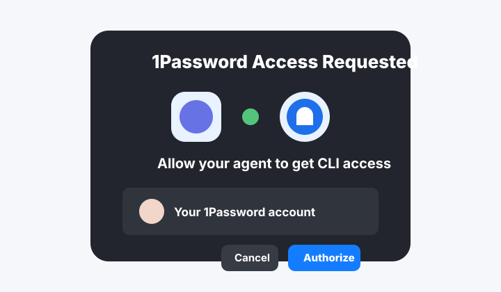

<p align="center">
  
</p>

# 1Password Agent MCP

Local MCP access to approved 1Password logins for AI agents.

Agents receive encrypted local handles, not plaintext passwords. At the moment of copy or paste, the MCP resolves the secret locally through the 1Password CLI and sends it to the OS clipboard or active app.

The repo contains no personal 1Password data. Every install connects to that user's own 1Password CLI and local approval policy.

> Not affiliated with or endorsed by 1Password.


## How It Works

1. Create a dedicated 1Password vault named `MCPVAULT`.
2. Copy or move selected logins from your normal vaults into `MCPVAULT`.
3. Approve each `MCPVAULT` login for specific websites.
4. Connect Claude Code, Codex, GitHub Copilot, or another MCP client.
5. The agent can paste approved passwords without seeing the plaintext.

The MCP tools only expose approved items from the configured agent vault.

## Quick Start

Install from npm:

```bash
npm install -g onepassword-agent-mcp
```

Or install from GitHub:

```bash
npm install -g github:gambadio/onepassword-agent-mcp
```

Check your setup:

```bash
onepassword-agent-mcp doctor
```

Connect installed MCP clients:

```bash
onepassword-agent-mcp setup all --apply
```

Start the local console:

```bash
onepassword-agent-mcp admin
```

Open:

```text
http://127.0.0.1:7319
```

Full walkthrough: [docs/USER_GUIDE.md](docs/USER_GUIDE.md)

Uninstall guide: [docs/UNINSTALL.md](docs/UNINSTALL.md)

## Does It Always Run?

No. This package does not install a launch agent, daemon, background service, startup item, browser extension, or hidden resident process.

- `onepassword-agent-mcp admin` runs the local approval console only while that terminal process is alive.
- `onepassword-agent-mcp mcp` is a stdio MCP server. MCP clients such as Claude Code, Codex, or VS Code launch it as a child process when they need it.
- `onepassword-agent-mcp setup ... --apply` only writes MCP client configuration.
- Restarting the computer does not auto-start this project unless a separate tool or user-created startup script launches an MCP client that then launches the MCP server.
- Persistent local state is limited to approvals and the local encryption key in `~/.onepassword-mcp`.

You can see this explanation any time:

```bash
onepassword-agent-mcp runtime
```

## Requirements

- Node.js 20+
- 1Password CLI (`op`)
- 1Password desktop app integration, or an `OP_SERVICE_ACCOUNT_TOKEN`
- An MCP client that supports local stdio servers

macOS:

```bash
brew install node 1password-cli
```

Enable the 1Password desktop integration:

1. Open 1Password.
2. Go to **Settings > Developer**.
3. Turn on **Integrate with 1Password CLI**.
4. When your agent or terminal asks for access, approve only clients you trust.



## The Local Console

The console is a small workbench:

- **Agent Vault Setup** checks whether `MCPVAULT` exists and can create it.
- **Vault Workbench** lets you drag a source login into the agent vault.
- **Choose From 1Password** searches your normal vaults.
- **Approve Agent Items** shows only items already in `MCPVAULT`.
- **Allowed For Agents** is the final allow list MCP clients can use.


Copy is the safe default. Move is available, but 1Password creates a new item in the destination vault and deletes the original item from the source vault.

Blank allowed-sites fields mean the approved item may be used on all URLs. Items in `MCPVAULT` can also be deleted from the approval console after a confirmation prompt.

## Client Setup

The setup CLI prints a dry run by default:

```bash
onepassword-agent-mcp setup all
```

Apply setup automatically where a supported CLI is installed:

```bash
onepassword-agent-mcp setup all --apply
```

### Claude Code

```bash
onepassword-agent-mcp setup claude-code --apply
```

Equivalent command:

```bash
claude mcp add --scope user onepassword-agent-mcp -- onepassword-agent-mcp mcp
```

### Codex

```bash
onepassword-agent-mcp setup codex --apply
```

Equivalent command:

```bash
codex mcp add onepassword-agent-mcp -- onepassword-agent-mcp mcp
```

### GitHub Copilot In VS Code

```bash
onepassword-agent-mcp setup copilot --apply
```

Equivalent VS Code command:

```bash
code --add-mcp '{"name":"onepassword-agent-mcp","command":"onepassword-agent-mcp","args":["mcp"]}'
```

Workspace fallback at `.vscode/mcp.json`:

```json
{
  "servers": {
    "onepassword-agent-mcp": {
      "type": "stdio",
      "command": "onepassword-agent-mcp",
      "args": ["mcp"]
    }
  }
}
```

### Other MCP Clients

Print generic MCP JSON:

```bash
onepassword-agent-mcp setup generic --json
```

Generic config:

```json
{
  "mcpServers": {
    "onepassword-agent-mcp": {
      "command": "onepassword-agent-mcp",
      "args": ["mcp"]
    }
  }
}
```

## Stop And Uninstall

Stop the local approval console by pressing `Ctrl-C` in the terminal running:

```bash
onepassword-agent-mcp admin
```

Disconnect MCP clients:

```bash
onepassword-agent-mcp uninstall all
onepassword-agent-mcp uninstall all --apply
```

The uninstall command removes Claude Code and Codex config entries where their CLIs are installed. VS Code currently exposes an add command but no stable remove flag in its CLI, so the command prints the manual VS Code cleanup step for Copilot.

Remove the global npm package:

```bash
npm uninstall -g onepassword-agent-mcp
```

Optional: delete this app's local approvals and encryption key:

```bash
onepassword-agent-mcp uninstall state
onepassword-agent-mcp uninstall state --apply
```

This deletes `~/.onepassword-mcp`. It does not delete 1Password vaults or items. Delete `MCPVAULT` inside 1Password only if you intentionally want to remove that vault.

## MCP Tools

- `onepassword_status`: check CLI, `MCPVAULT`, and local policy status.
- `find_passwords_for_site`: return approved encrypted handles for a website.
- `list_approved_passwords`: list approved handles and allowed sites.
- `copy_password`: resolve a handle and copy the password to the clipboard.
- `paste_password`: resolve a handle, copy it, paste into the active app, and return no plaintext.
- `clear_password_clipboard`: clear the clipboard.
- `admin_ui_info`: return the approval console URL.

## Security Model

Protected:

- Passwords are not stored by this project.
- MCP tools never return plaintext passwords.
- Handles and stored 1Password secret references are encrypted locally.
- Disabled or deleted approvals invalidate old handles.
- Allowed-site checks run again at copy and paste time.
- The MCP server only lists and resolves approvals from the configured agent vault.

Still sensitive:

- The OS clipboard briefly contains the plaintext password.
- The active app receives the password when paste is triggered.
- A local process with clipboard access may observe copied secrets.
- With desktop CLI integration, the local 1Password CLI session may have broader vault access than the MCP exposes.

For the strictest boundary, use a 1Password service account scoped only to `MCPVAULT`.

Read [docs/SECURITY.md](docs/SECURITY.md) before using this with powerful browser-control agents.

## Local State

Default state location:

```text
~/.onepassword-mcp/policy.json
~/.onepassword-mcp/key.bin
```

Use a different state directory:

```bash
ONEPASSWORD_MCP_HOME=/path/to/state onepassword-agent-mcp admin
```

Use a different agent vault name:

```bash
MCP_VAULT_NAME=AgentVault onepassword-agent-mcp admin
```

Headless service-account example:

```json
{
  "mcpServers": {
    "onepassword-agent-mcp": {
      "command": "onepassword-agent-mcp",
      "args": ["mcp"],
      "env": {
        "OP_SERVICE_ACCOUNT_TOKEN": "ops_...",
        "MCP_VAULT_NAME": "MCPVAULT"
      }
    }
  }
}
```

Do not commit service account tokens.

## Troubleshooting

Run:

```bash
onepassword-agent-mcp doctor
```

Common fixes:

- `op` missing: install the 1Password CLI.
- 1Password auth failure: enable desktop CLI integration or set `OP_SERVICE_ACCOUNT_TOKEN`.
- `MCPVAULT` missing: start the admin console and click **Create MCPVAULT**.
- Copilot setup cannot find `code`: install the VS Code shell command or use `.vscode/mcp.json`.
- Admin UI not running: run `onepassword-agent-mcp admin`.

## Development

Clone the repo:

```bash
git clone https://github.com/gambadio/onepassword-agent-mcp.git
cd onepassword-agent-mcp
npm install
```

Run checks:

```bash
npm run build
npm run typecheck
npm test
```

Run locally:

```bash
npm run dev:admin
npm run dev:mcp
```

## License

MIT
