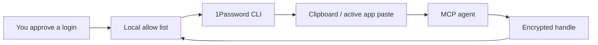

<p align="center">
  
</p>

# 1Password Agent Bridge

Approve exactly which 1Password logins an AI agent may use, then let the agent paste them without ever receiving the plaintext password.

This is a local Model Context Protocol (MCP) server. It sits between your MCP client and the 1Password CLI, gives agents opaque encrypted handles, and resolves the real password only at copy/paste time.

> Not affiliated with or endorsed by 1Password.


## Why This Exists

Browser-control agents can fill login forms, but handing an LLM your passwords is a bad default. 1Password Agent Bridge gives you a small local approval console:

- Search your 1Password Login and Password items.
- Approve only the entries an agent may use.
- Restrict each approval to specific websites.
- Give the agent encrypted handles, not plaintext.
- Resolve the real secret only when the agent asks to copy or paste.

## How It Works



The model sees metadata and handles like:

```text
opmcp:v1:...
```

It does not receive:

```text
your-real-password
```

## Requirements

- macOS, Linux, or Windows with Node.js 20+
- 1Password CLI (`op`)
- 1Password desktop app integration, or an `OP_SERVICE_ACCOUNT_TOKEN`
- An MCP client that supports stdio servers

macOS install:

```bash
brew install 1password-cli
```

Then enable 1Password desktop integration:

1. Open 1Password.
2. Go to **Settings > Developer**.
3. Turn on **Integrate with 1Password CLI**.
4. When prompted, authorize CLI access for your MCP client.


## Install

Clone and build:

```bash
git clone https://github.com/gambadio/onepassword-agent-bridge.git
cd onepassword-agent-bridge
npm install
npm run build
```

Start the approval console:

```bash
npm run start:admin
```

Open:

```text
http://127.0.0.1:7319
```

## Approve Logins

1. Open the approval console.
2. Search for an item by title, site, vault, or account label.
3. Click **Approve** on the entries your agents may use.
4. Check or edit the allowed site list before approval.

Approved entries appear under **Allowed For Agents**. The MCP server will only return handles for matching sites.

### What Is "Advanced: add a copied secret reference"?

Most users should ignore it.

Use it only when the importer cannot infer the right field, for example a custom field or token. In 1Password, copy a secret reference such as:

```text
op://Private/GitHub/password
```

Then paste that reference into the advanced form. The bridge stores that reference encrypted in local policy. It still does not store the actual password.

### What Are "Local Settings"?

Usually you can leave them alone.

- `1Password CLI path`: where the `op` binary lives. Default: `op`.
- `Account`: optional 1Password account selector.
- `Default vault`: optional vault to search first.
- `Clipboard clear seconds`: how quickly the bridge clears copied secrets.
- `Allow paste without expected site`: off by default; leave it off unless you know why you need it.

## MCP Client Config

Add a stdio server to your MCP client:

```json
{
  "mcpServers": {
    "onepassword-agent-bridge": {
      "command": "node",
      "args": ["/absolute/path/to/onepassword-agent-bridge/dist/src/mcp.js"]
    }
  }
}
```

For local Codex/Claude-style config, use the absolute path to this repo's built `dist/src/mcp.js`.

## MCP Tools

- `onepassword_status`: check CLI and local policy status.
- `find_passwords_for_site`: return approved encrypted handles for a website.
- `list_approved_passwords`: list approved handles and allowed sites.
- `copy_password`: resolve a handle and copy the password to clipboard.
- `paste_password`: resolve a handle, copy it, paste into the active app, and return no plaintext.
- `clear_password_clipboard`: clear the clipboard.
- `admin_ui_info`: return the approval console URL.

## State Files

Default local state:

```text
~/.onepassword-mcp/policy.json
~/.onepassword-mcp/key.bin
```

Override state location:

```bash
ONEPASSWORD_MCP_HOME=/path/to/state npm run start:admin
```

## Security Model

Protected:

- Passwords are not stored by this project.
- MCP tools never return plaintext passwords.
- Handles and stored 1Password secret references are encrypted locally.
- Disabled or deleted approvals invalidate old handles.
- Allowed-site checks happen again at copy/paste time.

Still sensitive:

- The OS clipboard briefly contains the plaintext password.
- The active app receives the password when paste is triggered.
- A local malicious process with clipboard access can still be a problem.

Read [docs/SECURITY.md](docs/SECURITY.md) before using this with powerful browser-control agents.

## Development

```bash
npm install
npm run build
npm run typecheck
npm test
```

Run the admin UI:

```bash
npm run dev:admin
```

Run the MCP server:

```bash
npm run dev:mcp
```

## License

MIT
