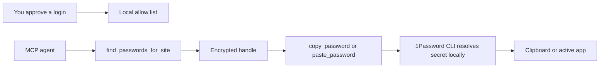

<p align="center">
  
</p>

# 1Password Agent Bridge

Local MCP access to approved 1Password items for AI agents.

The agent can ask for an approved login, receive an encrypted opaque handle, and paste the password into the active app or browser. The model does not receive the plaintext password. The real secret is resolved locally through the 1Password CLI only at copy or paste time.

The repo does not contain any user's 1Password data. Each install connects to that user's own local 1Password CLI and local approval policy.

> Not affiliated with or endorsed by 1Password.


## Quick Start

Install the bridge from this public GitHub repo:

```bash
npm install -g github:gambadio/onepassword-agent-bridge
```

Check your local setup:

```bash
onepassword-agent-bridge doctor
```

Configure the MCP clients you already have installed:

```bash
onepassword-agent-bridge setup all --apply
```

Start the local approval console:

```bash
onepassword-agent-bridge admin
```

Open:

```text
http://127.0.0.1:7319
```

Search your 1Password items, approve only the entries your agents may use, and restrict each approval to the websites where it is allowed.

## Requirements

- Node.js 20+
- 1Password CLI (`op`)
- 1Password desktop app integration, or an `OP_SERVICE_ACCOUNT_TOKEN`
- An MCP client that supports local stdio servers

macOS:

```bash
brew install node 1password-cli
```

Enable the 1Password desktop integration:

1. Open 1Password.
2. Go to **Settings > Developer**.
3. Turn on **Integrate with 1Password CLI**.
4. When your agent or terminal asks for access, approve only clients you trust.


## What Gets Installed

The package installs one main command:

```bash
onepassword-agent-bridge
```

Useful subcommands:

```bash
onepassword-agent-bridge admin        # start the local approval console
onepassword-agent-bridge mcp          # start the stdio MCP server
onepassword-agent-bridge doctor       # check Node, op, auth, state, and admin UI
onepassword-agent-bridge setup all    # print client setup commands
onepassword-agent-bridge setup all --apply
```

MCP clients should run this server command:

```bash
onepassword-agent-bridge mcp
```

You normally do not run `mcp` yourself. Claude Code, Codex, Copilot, or another MCP client starts it when needed.

## Client Setup

The setup CLI prints a dry run by default:

```bash
onepassword-agent-bridge setup all
```

Apply the setup automatically where a supported CLI is installed:

```bash
onepassword-agent-bridge setup all --apply
```

### Claude Code

```bash
onepassword-agent-bridge setup claude-code --apply
```

Equivalent command:

```bash
claude mcp add --scope user onepassword-agent-bridge -- onepassword-agent-bridge mcp
```

Use another Claude Code scope when you want project-local config instead:

```bash
onepassword-agent-bridge setup claude-code --apply --scope local
```

### Codex

```bash
onepassword-agent-bridge setup codex --apply
```

Equivalent command:

```bash
codex mcp add onepassword-agent-bridge -- onepassword-agent-bridge mcp
```

### GitHub Copilot In VS Code

```bash
onepassword-agent-bridge setup copilot --apply
```

Equivalent VS Code command:

```bash
code --add-mcp '{"name":"onepassword-agent-bridge","command":"onepassword-agent-bridge","args":["mcp"]}'
```

If the `code` command is not in your `PATH`, create `.vscode/mcp.json` in your workspace:

```json
{
  "servers": {
    "onepassword-agent-bridge": {
      "type": "stdio",
      "command": "onepassword-agent-bridge",
      "args": ["mcp"]
    }
  }
}
```

### Other MCP Clients

Print generic MCP JSON:

```bash
onepassword-agent-bridge setup generic --json
```

Generic config:

```json
{
  "mcpServers": {
    "onepassword-agent-bridge": {
      "command": "onepassword-agent-bridge",
      "args": ["mcp"]
    }
  }
}
```

## Approving Logins

1. Run `onepassword-agent-bridge admin`.
2. Open `http://127.0.0.1:7319`.
3. Use **Find Logins To Approve**.
4. Search by title, website, vault, or account label.
5. Click **Approve** only for entries your agents may use.
6. Keep or edit the allowed sites before approval.

Approved entries appear under **Allowed For Agents**. Agents only receive handles for enabled approvals, and allowed-site checks run again at copy and paste time.

### What Is "Advanced: add a copied secret reference"?

Most users should ignore it.

Use it only when the importer cannot infer the right field, for example a custom token or non-standard field. In 1Password, copy a secret reference such as:

```text
op://ExampleVault/ExampleLogin/password
```

Paste that reference into the advanced form. The bridge stores the reference encrypted in local policy. It still does not store the actual password.

### What Are "Local Settings"?

Usually you can leave these alone.

- `1Password CLI path`: where the `op` binary lives. Default: `op`.
- `Account`: optional 1Password account selector.
- `Default vault`: optional vault to search first.
- `Clipboard clear seconds`: how quickly copied secrets are cleared.
- `Allow paste without expected site`: off by default. Keep it off unless you know why you need it.

## How Agents Use It



The model may see a handle like:

```text
opmcp:v1:...
```

It should not see:

```text
your-real-password
```

Available MCP tools:

- `onepassword_status`: check CLI and local policy status.
- `find_passwords_for_site`: return approved encrypted handles for a website.
- `list_approved_passwords`: list approved handles and allowed sites.
- `copy_password`: resolve a handle and copy the password to the clipboard.
- `paste_password`: resolve a handle, copy it, paste into the active app, and return no plaintext.
- `clear_password_clipboard`: clear the clipboard.
- `admin_ui_info`: return the approval console URL.

## Local State

Default state location:

```text
~/.onepassword-mcp/policy.json
~/.onepassword-mcp/key.bin
```

Use a different state directory:

```bash
ONEPASSWORD_MCP_HOME=/path/to/state onepassword-agent-bridge admin
```

Headless service-account example:

```json
{
  "mcpServers": {
    "onepassword-agent-bridge": {
      "command": "onepassword-agent-bridge",
      "args": ["mcp"],
      "env": {
        "OP_SERVICE_ACCOUNT_TOKEN": "ops_..."
      }
    }
  }
}
```

Do not commit service account tokens.

## Security Model

Protected:

- Passwords are not stored by this project.
- MCP tools never return plaintext passwords.
- Handles and stored 1Password secret references are encrypted locally.
- Disabled or deleted approvals invalidate old handles.
- Allowed-site checks happen again at copy and paste time.

Still sensitive:

- The OS clipboard briefly contains the plaintext password.
- The active app receives the password when paste is triggered.
- A local process with clipboard access may observe copied secrets.
- Any approved agent can use approved entries within the allowed-site policy.

Read [docs/SECURITY.md](docs/SECURITY.md) before using this with powerful browser-control agents.

## Troubleshooting

Run:

```bash
onepassword-agent-bridge doctor
```

Common fixes:

- `op` missing: install the 1Password CLI.
- 1Password auth failure: enable desktop CLI integration or set `OP_SERVICE_ACCOUNT_TOKEN`.
- Copilot setup cannot find `code`: install the VS Code shell command or use `.vscode/mcp.json`.
- Existing MCP entry conflicts: remove the old entry in that client, then run setup again.
- Admin UI not running: run `onepassword-agent-bridge admin`.

## Development

Clone the repo:

```bash
git clone https://github.com/gambadio/onepassword-agent-bridge.git
cd onepassword-agent-bridge
npm install
```

Run checks:

```bash
npm run build
npm run typecheck
npm test
```

Run locally:

```bash
npm run dev:admin
npm run dev:mcp
```

## License

MIT
