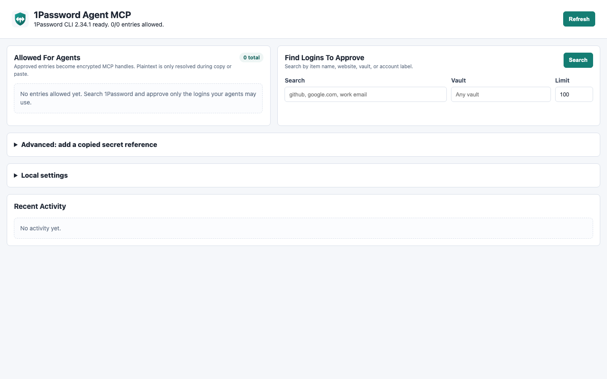

# Setup Guide

This guide shows the full local setup flow for 1Password Agent Bridge.

## 1. Install Requirements

macOS:

```bash
brew install node 1password-cli
```

Verify:

```bash
node --version
op --version
```

Node.js must be version 20 or newer.

## 2. Enable 1Password CLI Integration

1. Open the 1Password desktop app.
2. Open **Settings > Developer**.
3. Turn on **Integrate with 1Password CLI**.

When your MCP client first asks for secrets, 1Password may show a prompt:


Click **Authorize** only for MCP clients you trust.

## 3. Install The Bridge

```bash
npm install -g https://github.com/gambadio/onepassword-agent-bridge/archive/refs/heads/main.tar.gz
```

Run:

```bash
onepassword-agent-bridge doctor
```

Fix any required checks before continuing.

## 4. Connect MCP Clients

Dry run:

```bash
onepassword-agent-bridge setup all
```

Apply setup for installed clients:

```bash
onepassword-agent-bridge setup all --apply
```

Individual clients:

```bash
onepassword-agent-bridge setup claude-code --apply
onepassword-agent-bridge setup codex --apply
onepassword-agent-bridge setup copilot --apply
```

For unsupported clients, print generic MCP JSON:

```bash
onepassword-agent-bridge setup generic --json
```

## 5. Start The Approval Console

```bash
onepassword-agent-bridge admin
```

Open:

```text
http://127.0.0.1:7319
```

The console should show `1Password CLI ready`.

## 6. Search And Approve



Use **Find Logins To Approve** to search your 1Password entries by:

- item title
- website
- vault
- account label

Click **Approve** only for entries your agents may use. Keep or edit the allowed-site list before approving.

## 7. Test With An Agent

Ask the agent to:

1. Open a site you approved.
2. Call `find_passwords_for_site` with the current URL.
3. Click the password field.
4. Call `paste_password` with the encrypted handle and `expectedSite`.

The agent should not receive the plaintext password.

## Update

Install the latest version from GitHub again:

```bash
npm install -g https://github.com/gambadio/onepassword-agent-bridge/archive/refs/heads/main.tar.gz
```

Your approvals live in `~/.onepassword-mcp` and are not replaced by reinstalling the package.
