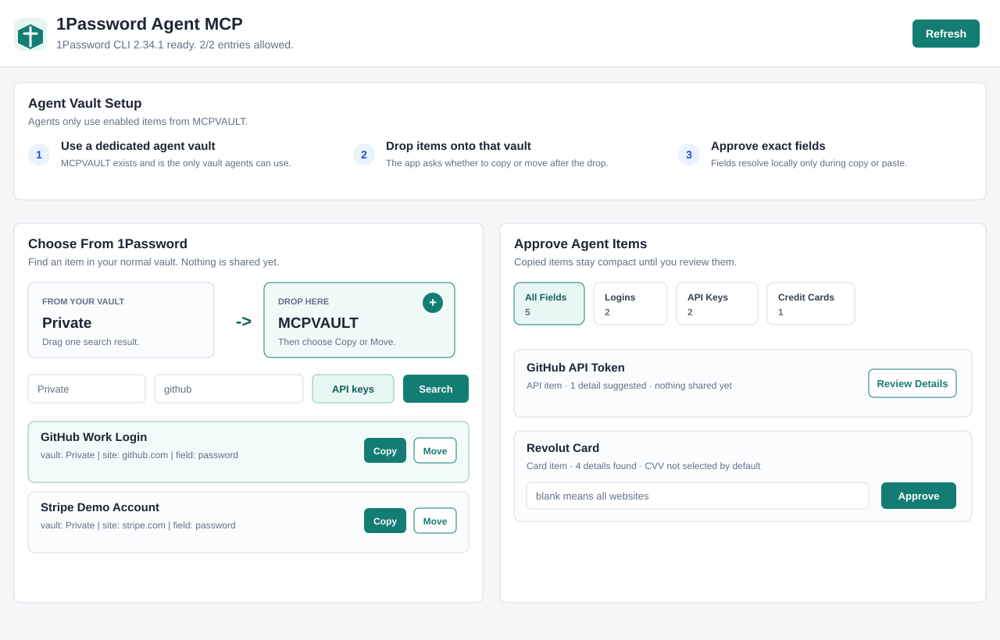
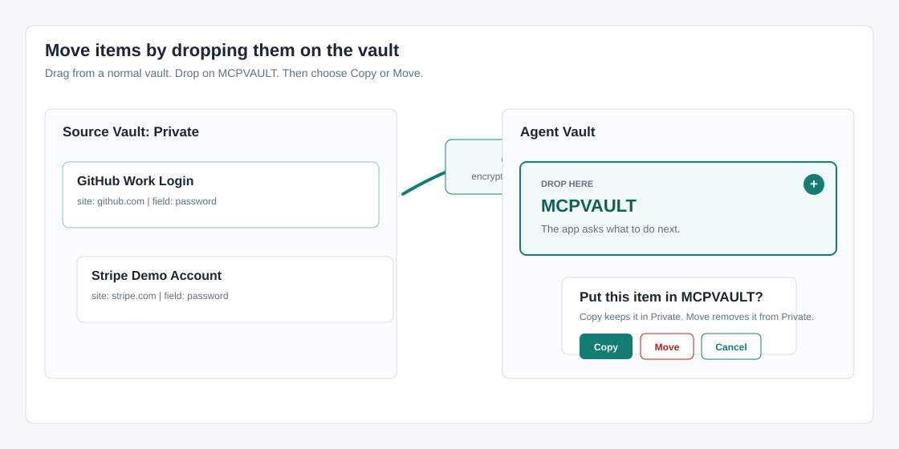
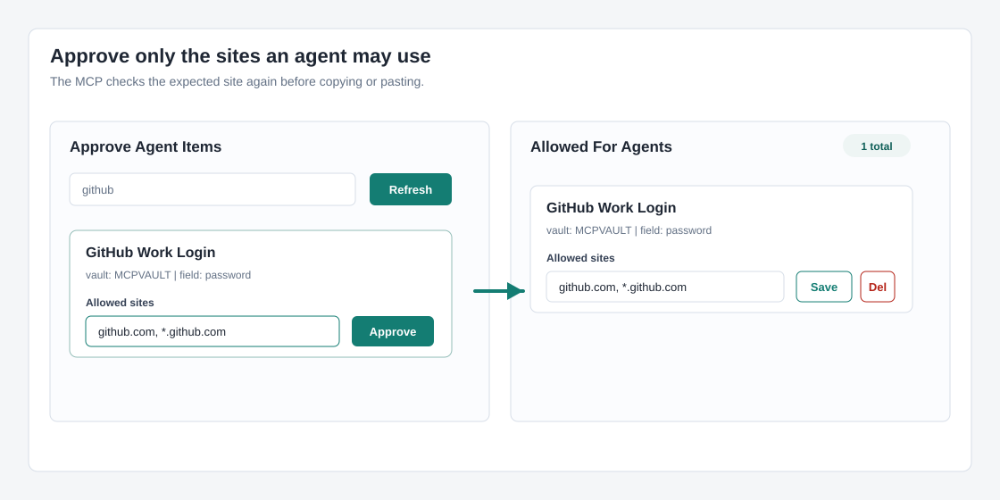

# User Guide

This guide uses fake example vaults and logins. Your install connects only to your own local 1Password account.

## The Simple Model

1Password Agent MCP uses one dedicated vault for AI agents:

```text
MCPVAULT
```

Put only the logins you are comfortable letting agents use into that vault. Then approve each login for specific websites.



## First Run

Install the package:

```bash
npm install -g https://github.com/gambadio/onepassword-agent-mcp/archive/refs/tags/v0.2.3.tar.gz
```

Check your machine:

```bash
onepassword-agent-mcp doctor
```

Start the local console:

```bash
onepassword-agent-mcp admin
```

Open:

```text
http://127.0.0.1:7319
```

## Step 1: Create MCPVAULT

If the console says `MCPVAULT does not exist yet`, click **Create MCPVAULT**.

That creates an empty 1Password vault. It does not copy, move, or approve anything yet.

## Step 2: Copy Or Move Logins Into MCPVAULT

Use **Choose From 1Password**:

1. Pick your source vault, such as `Private`.
2. Search by login name, website, or account label.
3. Drag the login to **Copy Into MCPVAULT** or **Move Into MCPVAULT**.



Use **Copy** first when you are unsure. Copy leaves the original item in the source vault.

Use **Move** only when you want the login removed from the source vault. 1Password creates a new item in the destination vault, so the item ID changes.

## Step 3: Approve Agent Sites

After a login is inside `MCPVAULT`, it appears under **Approve Agent Items**.

1. Search the agent vault.
2. Enter allowed sites, such as:

```text
github.com, *.github.com
```

Leave allowed sites blank when the login may be used on any URL.

3. Click **Approve**.



Approved logins appear under **Allowed For Agents**. Agents can request encrypted handles for those entries, but the MCP does not return plaintext passwords.

## Delete An Agent Vault Item

In **Approve Agent Items**, click **Delete** next to an item to remove it from `MCPVAULT`.

The console asks for confirmation first. 1Password moves deleted items to Recently Deleted, and any local agent approval for that item is removed.

## What Agents Can Do

Agents can:

- Ask which approved passwords match the current website.
- Receive encrypted local handles.
- Ask the MCP to copy or paste a password.

Agents cannot:

- Search your whole 1Password account through the MCP.
- See plaintext passwords in model responses.
- Use entries that are not enabled under **Allowed For Agents**.
- Use a password for the wrong site unless you turn on the unsafe advanced setting.

## What Is The Expert Fallback?

Most users should ignore **Expert fallback: add a secret reference manually**.

Use it only when the normal search cannot show the exact field you need, for example a custom API token field. The secret reference must point at an item in `MCPVAULT`, for example:

```text
op://MCPVAULT/GitHub deploy token/password
```

The app encrypts that reference locally. It still does not store the password.

## What Are Advanced Local Settings?

Most users can leave them alone.

- `Agent vault name`: the dedicated vault agents may use. Default: `MCPVAULT`.
- `1Password CLI path`: where the `op` command lives. Default: `op`.
- `Account`: optional account shorthand or sign-in address.
- `Clipboard clear seconds`: how long a copied password stays on the clipboard.
- `Allow paste without expected site`: keep this off. It removes the site safety check.

## Best Practice

Use desktop 1Password CLI integration for interactive local use.

For stricter production or headless use, create a 1Password service account that has access only to `MCPVAULT`, then run the MCP with `OP_SERVICE_ACCOUNT_TOKEN`.
